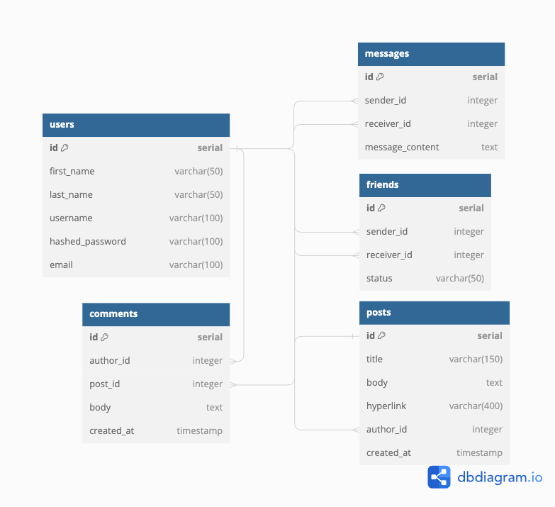
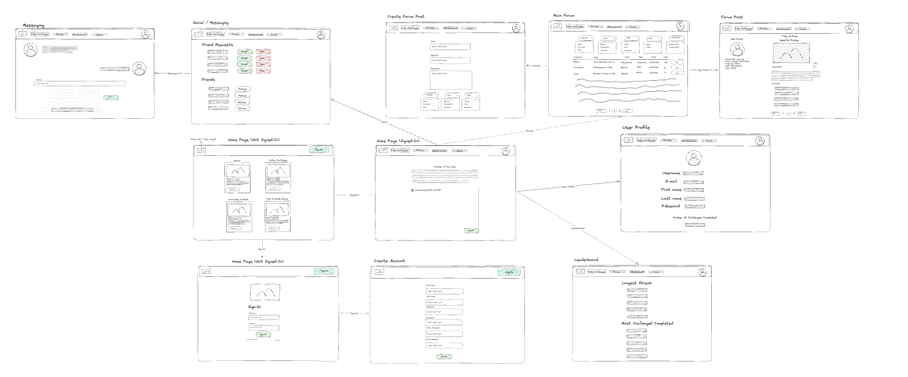

# Accodability

## How To Run This Project

**Pre-reqs: Git, Docker**

1. Fork the repository; clone its files to your local machine using the terminal command below: - `git clone https://gitlab.com/its-not-a-phad/accodability.git`
   Note: the forked repo link will be different than the original link above.
   ​
2. Build and run the project with the following Docker commands in your terminal:

   ```
   #Script to fully build docker containers in one line:
   docker volume create pg-admin; docker volume create accodability-data ; docker compose build; docker compose up

   Script to stop and delete all docker containers to restart development database:

   Windows:
   docker stop (docker ps -aq); docker rm (docker ps -aq); docker rmi (docker images -aq); docker volume rm (docker volume ls -q); docker system prune -af

   Mac:
   docker stop $(docker ps -aq) && docker rm $(docker ps -aq) && docker rmi $(docker images -aq) && docker volume rm $(docker volume ls -q) && docker system prune -af

   Individual commands:
   docker volume create accodability-data
   docker volume create pg-admin
   docker-compose build
   docker-compose up
   ```

3. Verify that each Docker container is running; there should be (4) in total: accodability-postgres-1, accodability-ghi-1, accodability-fastapi-1, accodability-pg-admin-1
   ​
4. You can view the Accodability web app in your browser @ http://localhost:3000/.

5. You can view the FastAPI web app in your browser @ http://localhost:8000/docs#/.

6. You can view the PGAdmin web app in your browser @ http://localhost:8082/.

### Directories

The /ghi/ folder contains all the files for the front end (available to view at htttp://localhost:3000)
The /api/ folder contains all the files for the back end endpoints (available to view at http://localhost:8000/docs#)

- Here you will be able to view all CRUD functionality and the functionality

  - The /api/migrations/001_migrations.py file contains the necessary SQL commands required to set up the PostgreSQL database to operate Accodability (available to view at http://localhost:8082)
  - Login information and database naming convention can be found in the (docker-compose.yaml) file under pg-admin and postgres.
  - Use the information under pg-admin/environment to log into localhost:8082. Use the information under postgres to correctly name the database and input the corresponsing user information.

### Database Schema

```
// Use DBML to define your database structure
// Docs: https://dbml.dbdiagram.io/docs

Table users {
  id serial [primary key]
  first_name varchar(50)
  last_name varchar(50)
  username varchar(100)
  hashed_password varchar(100)
  email varchar(100)
}

Table posts {
  id serial [primary key]
  title varchar(150)
  body text
  hyperlink varchar(400)
  author_id integer [ref: > users.id]
  created_at timestamp
}

Table comments {
  id serial [primary key]
  author_id integer [ref: > users.id]
  post_id integer [ref: > posts.id]
  body text
  created_at timestamp
}

Table friends {
  id serial [primary key]
  sender_id integer [ref: > users.id]
  receiver_id integer [ref: > users.id]
  status varchar(50)
}

Table messages {
  id serial [primary key]
  sender_id integer [ref: > users.id]
  receiver_id integer [ref: > users.id]
  message_content text
}
```

### Wire-Frame (Initial Draft)


## API Design

### Users

```
+-------------------------------------+----------+---------------------------------------------------------+
|               Action                |  Method  |                           URL                           |
+-------------------------------------+----------+---------------------------------------------------------+
| Create User                         |  POST    |  http://localhost:8000/users/                           |
| Get Token                           |  GET     |  http://localhost:8000/token/                           |
| Get All Users                       |  GET     |  http://localhost:8000/users/                           |
| Update User                         |  PUT     |  http://localhost:8000/users/:id/                       |
| Delete User                         |  DELETE  |  http://localhost:8000/users/:id/                       |
| Get User by Username, Email, or ID  |  GET     |  http://localhost:8000/users/:username, :email, or :id/ |
| Get Current User ID                 |  GET     |  http://localhost:8000/currentuser/                     |
+-------------------------------------+----------+---------------------------------------------------------+
```

Users

URL: http://localhost:8000

Path: /users

Get All users GET http://localhost:8000/users/

Output:

```
{
"id": "1",
"first_name": "string",
"last_name": "string",
"username": "string",
"email": "string"
},
{
"id": "2",
"first_name": "phat",
"last_name": "nguyen",
"username": "phatnguyen",
"email": "phat@test.com"
},
```

Create users POST http://localhost:8000/current/

```
Input:

{
"first_name": "string",
"last_name": "string",
"username": "string",
"password": "string",
"email": "string"
}
```

Output:

Update users PUT http://localhost:8000/users/:id

```
Input:
{
"first_name": "string",
"last_name": "string",
"username": "string",
"password": "string",
"email": "string"
}
```

Output:

```
{
"id": "1",
"first_name": "string",
"last_name": "string",
"username": "string",
"email": "string"
}
```

Delete users DELETE http://localhost:8000/users/:id
Output:

```
true
```

Get One users GET http://localhost:8000/users/{username_email_or_id}
Search username email or id number

Output:

```
{
"id": "2",
"first_name": "phat",
"last_name": "nguyen",
"username": "phatnguyen",
"email": "phat@test.com"
}
```

### Messages

```
+----------------------+----------+----------------------------------+
|       Action         |  Method  |                URL               |
+----------------------+----------+----------------------------------+
| Create Message       |  POST    |  http://localhost:8000/messages/ |
| Get Message (Inbox)  |  GET     |  http://localhost:8000/messages/ |
+----------------------+----------+----------------------------------+
```

Path: /messages

Create message POST http://localhost:8000/messages

Input:

```
{
  "sender_id": 1,
  "receiver_id": 2,
  "message_content": "Hello Friend"
}
```

Output:

```
{
  "Message": " Message sent to user successfully"
}
```

Get Message Inbox GET http://localhost:8000/messages

Output:

```
{
  "Message Inbox": [
    {
      "id": 1,
      "sender_id": 2,
      "receiver_id": 1,
      "message_content": "asdfads"
    },
    {
      "id": 2,
      "sender_id": 5,
      "receiver_id": 1,
      "message_content": "asdf"
    },
    {
      "id": 3,
      "sender_id": 1,
      "receiver_id": 2,
      "message_content": "Hello Friend"
    }
  ]
}
```

### Friends

```
+------------------------------+----------+---------------------------------------------+
|           Action             |  Method  |                     URL                     |
+------------------------------+----------+---------------------------------------------+
| Send Friend Request          |  POST    |  http://localhost:8000/friends/             |
| Get Pending Friend Requests  |  GET     |  http://localhost:8000/friends/             |
| Accept Friend Request        |  PUT     |  http://localhost:8000/friends/:id(sender)/ |
+------------------------------+----------+---------------------------------------------+
```

The (friends) table is a PostgreSQL table that is related to the (users) table. Required parameters include sender_id and receiver_id. - The status row of the table is automatically defaulted to 'pending'. - Upon accepting a friend request the status will update to 'accepted'. The friend requests are also constrained so that the friend requests are unique to the id's. - The sender_id and receiver_id values both reference the 'id' value from an account's (user) table. - Below are examples of specific requests to the endpoints with example input and expected output:

        Send Friend Request (POST, http://localhost:8000/friends)
          Request body (input):
          ```
          {
            "sender_id": 1,
            "receiver_id": 2
          }
          ```
          Curl
          ```
          curl -X 'POST' \
            'http://localhost:8000/friends' \
            -H 'accept: application/json' \
            -H 'Content-Type: application/json' \
            -d '{
            "sender_id": 1,
            "receiver_id": 2
          }'
          ```
          200 OK Response:
          ```
          {
            "Friend Request Message": "Friend request sent successfully"
          }
          ```

        Accept Friend Request (PUT, http://localhost:8000/friends/{sender_id})
          Request body (input):
          ```
          {
            "sender_id": 1,
            "receiver_id": 2
          }
          ```
          Curl
          ```
          curl -X 'PUT' \
            'http://localhost:8000/friends/{sender_id}' \
            -H 'accept: application/json' \
            -H 'Content-Type: application/json' \
            -d '{
            "sender_id": 1,
            "receiver_id": 2
        }'
          ```
          200 OK Response:
          ```
          {
            "id": 13,
            "sender_id": 1,
            "receiver_id": 2,
            "status": "approved"
          }
          ```
        Get Friend List (GET, http://localhost:8000/friends), Logged in user will be "receiver_id":
          Curl
          ```
          curl -X 'GET' \
            'http://localhost:8000/friends' \
            -H 'accept: application/json'
          ```
          200 OK Response:
          ```
          [
            {
              "id": 1,
              "sender_id": 2,
              "receiver_id": 1,
              "status": "approved"
            },
            {
              "id": 2,
              "sender_id": 3,
              "receiver_id": 1,
              "status": "pending"
            },
          ]
          ```

### Posts

```
+-------------------------+----------+---------------------------------------+
|         Action          |  Method  |                  URL                  |
+-------------------------+----------+---------------------------------------+
| Get All Posts           |  GET     |  http://localhost:8000/api/posts/     |
| Create Post             |  POST    |  http://localhost:8000/api/posts/     |
| Delete a Specific Post  |  DELETE  |  http://localhost:8000/api/posts/:id/ |
| Get a Specific Post     |  GET     |  http://localhost:8000/api/posts/:id/ |
| Update a Specific Post  |  PUT     |  http://localhost:8000/api/posts/:id/ |
+-------------------------+----------+---------------------------------------+
```

        ### List Posts (GET):
        http://localhost:8000/posts
        Returns a list of all posts
        ```
        //
        {
            "id": 1,
            "title": "string",
            "body": "hi i am diana",
            "hyperlink": "string",
            "author_id": 1,
            "created_at": "2023-09-09T01:44:24.614888"
          },
          {
            "id": 2,
            "title": "swsdf",
            "body": "sdsdds",
            "hyperlink": "sdfsf",
            "author_id": 1,
            "created_at": "2023-09-10T23:14:11.161426"
          },
          {
            "id": 3,
            "title": "assdass",
            "body": "asdsadsa",
            "hyperlink": "asdasas",
            "author_id": 1,
            "created_at": "2023-09-11T00:35:38.138720"
          },
        ```

        ### Create a new post (POST):
        http://localhost:8000/posts

        ```
        Example Input:
        ```
        {
          "title": "string2",
          "body": "string",
          "hyperlink": "string",
          "author_id": 1
        }

        Example Reponse:
        ```
        {
          "id": 4,
          "title": "string2",
          "body": "string",
          "hyperlink": "string",
          "author_id": 1,
          "created_at": "1970-01-01T00:00:01+00:00"
        }
        ```

        ### Update a specific post (PUT):
        http://localhost:8000/posts/{id}
        Updating a post, change any fields

        Example Input:
        ```
        {
          "title": "strinassg",
          "body": "string",
          "hyperlink": "string",
          "author_id": 1
        }
        ```
        ```
        {
          "id": 4,
          "title": "strinassg",
          "body": "string",
          "hyperlink": "string",
          "author_id": 1,
          "created_at": "2023-09-11T17:37:31.532944"
        }
        ```

        ### Delete a specific post (DELETE):
        http://localhost:8000/posts/{id}
        Delete a post

        Example Input:
        ```
        [
          "4"
        ]
        ```

        Example Response:
        ```
        {
          "message": "Post deleted successfully"
        }
        ```
        </details>

        <details>
          <summary>Posts</summary>

        ### Get request to fetch specific post (GET):
        http://localhost:8000/posts/{id}
        Returns a specific posts by id

        Example Input:
        ```
        [
          3
        ]
        ```
        Example Response:
        ```
        {
            "id": 3,
            "title": "assdass",
            "body": "asdsadsa",
            "hyperlink": "asdasas",
            "author_id": 1,
            "created_at": "2023-09-11T00:35:38.138720"
          }

        ```

### Comments

Comments API Overview - Requests
```
+--------------------+----------+----------------------------------------------------+
|      Action        |  Method  |                         URL                        |
+--------------------+----------+----------------------------------------------------+
| Get Comments       |  GET     |  http://localhost:8000/api/posts/:id/comments/     |
| Create Comment     |  POST    |  http://localhost:8000/api/posts/:id/comments/     |
| Delete Comment     |  DELETE  |  http://localhost:8000/api/posts/:id/comments/:id/ |
| Update Comment     |  PUT     |  http://localhost:8000/api/posts/:id/comments/:id/ |
| Get User Comments  |  GET     |  http://localhost:8000/api/users/:id/comments/     |
+--------------------+----------+----------------------------------------------------+
```
Comments API Overview - JSON POST/PUT Requests
```
+-----------------+----------+------------------------------------------------------------+
|     Action      |  Method  |                     JSON Body - Example                    |
+-----------------+----------+------------------------------------------------------------+
| Create Comment  |  POST    |  {"author_id": 1, "post_id": 1, "body": "First Comment!"}  |
| Update Comment  |  PUT     |  {"author_id": 1, "post_id": 1, "body": "Updated Comment"} |
+-----------------+----------+------------------------------------------------------------+
```

1. Get All Comments
  - Path: http://localhost:8000/api/posts/{post_id}/comments
  - Method: GET
  - Example - Successful Response (Status - 200):
```
[
  {
    "id": 0,
    "author_id": 0,
    "post_id": 0,
    "body": "string",
    "created_at": "2023-09-11T21:24:17.612Z"
  }
]
```

2. Create Comment
  - Path: http://localhost:8000/api/posts/{post_id}/comments
  - Method: POST
  - Example - Successful Response (Status - 200):
```
{
  "id": 0,
  "author_id": 0,
  "post_id": 0,
  "body": "string",
  "created_at": "2023-09-11T21:27:16.230Z"
}
```
3. Update Comment
  - Path: http://localhost:8000/api/posts/{post_id}/comments/{id}
  - Method: PUT
  - Example - Successful Response (Status - 200):
```
{
  "id": 0,
  "author_id": 0,
  "post_id": 0,
  "body": "string",
  "created_at": "2023-09-11T21:28:22.850Z"
}
```
4. Delete Comment
  - Path: http://localhost:8000/api/posts/{post_id}/comments/{id}
  - Method: DELETE
  - Example - Successful Response (Status - 200)
```
true
```
5. Get Comments (For Logged-In User)
  - Path:
  - Method:
  - Example - Successful Response (Status - 200)
```
[
  {
    "id": 0,
    "author_id": 0,
    "post_id": 0,
    "body": "string",
    "created_at": "2023-09-11T21:32:46.339Z"
  }
]
```
## Deployment page:
https://its-not-a-phad.gitlab.io/accodability

